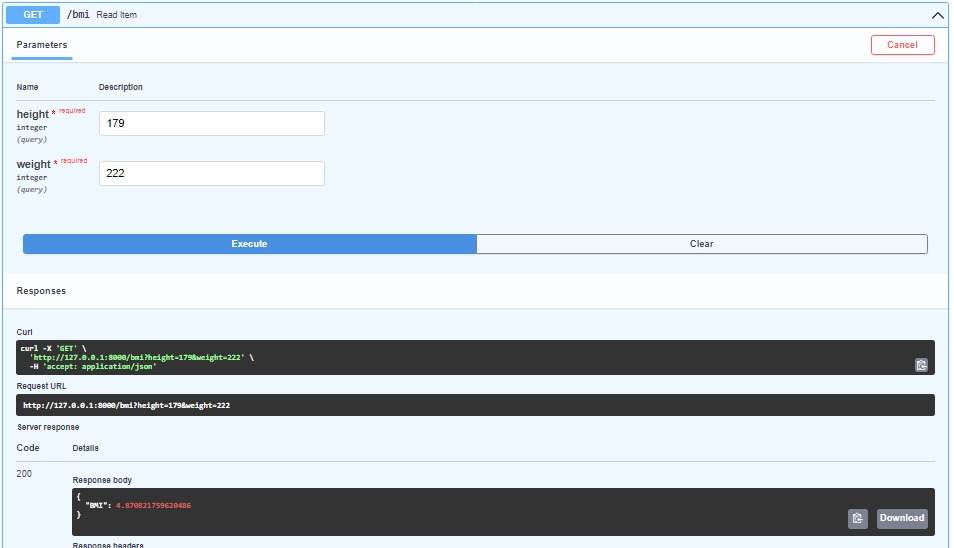
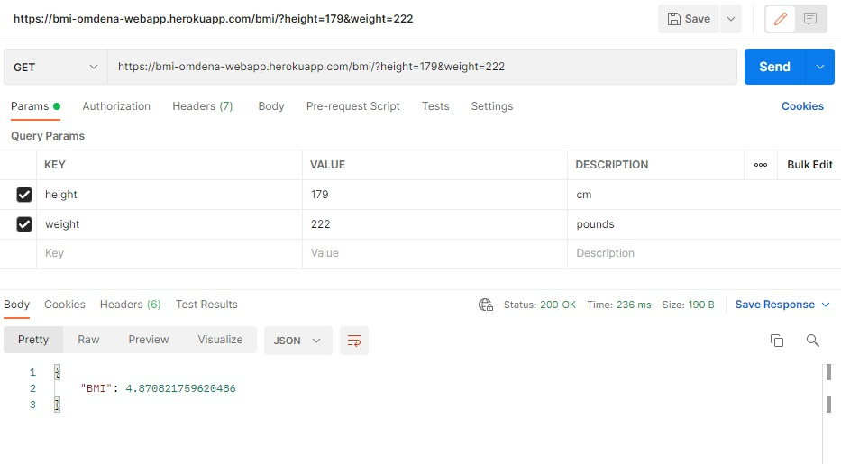

## Access Heroku API

`https://bmi-omdena-webapp.herokuapp.com/bmi`

## Test

- **inputs:** height(_inches_), weight(_pounds_)
- **outputs:** BMI

---

## Results

### FastAPI Docs:

### Postman:

